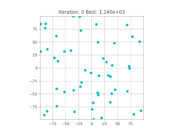

# PSOBench
PSOBench is a benchmarking suite written in Rust for multi-agent optimization algorithms. It provides a standardized set of test functions from CEC2017 and a framework for evaluating the performance of different optimization variants. It is able to run simultaneous optimizations in parallel on multiple threads at the same time. It also includes a visualizer written in Python that can parse and visualize the data outputted from the simulation.




## Features

- **Standardized Test Functions**: Includes a variety of commonly used benchmark functions for evaluating PSO and GSA algorithms, namely CEC2017.
- **Extensible Framework**: Easily add new optimization variants and test functions.
- **Performance Metrics**: Provides tools for measuring and comparing the performance of different algorithms.
- **Visualization Tools**: Generate plots to visualize the performance of algorithms over time.
- **Grid Search**: Supports grid search for hyperparameter tuning.

## Installation

### Clone the Repository

```bash
git clone https://github.com/massanf/psobench.git
cd psobench
```

### Build the Project

```bash
cargo build --release
```

## Usage

### Running Benchmarks

The main entry point for running benchmarks is the `main.rs` file. To run the benchmarks with the default configuration, use the following command:

```bash
cargo run --release
```

The `main.rs` file is configured to:

- Test different dimensions.
- Iterate through different normalizers.
- Optionally perform grid search for hyperparameter tuning.
- Run a specified number of iterations and attempts.

### Adding New Optimization Variants

1. Create a new module in the `optimizers` directory.
2. Implement your optimization algorithm as a class or a set of functions.
3. Update the `main.rs` file to include your new optimizer.

### Adding New Test Functions

1. Create a new module in the `functions` directory.
2. Implement your test function as a class or a set of functions.
3. Update the `main.rs` file to include your new test function.

### Grid Search Configuration

The `main.rs` file supports grid search for hyperparameter tuning. You can configure the grid search parameters in the `parameters` module. For example, `GSA_G0_OPTIONS` and `GSA_ALPHA_OPTIONS` define the range of values for the `g0` and `alpha` parameters, respectively.

### Visualizing Results

To generate performance plots:

```bash
python visualize_results.py
```

### Running the Visualizer

To run the visualizer:

```bash
source .venv/bin/activate
pipenv shell
python visualizer/main.py
```

## Data structure
```
data
└─ test name (test)
   └─ dimension (50)
      └─ optimizer name (gsa)
         └─ problem name (CEC2017_F01)
            └─ attempt name (0)
               ├─ config.json
               ├─ data.json
               └─ summary.json
```

`config.json`
```json
{
  "method": {
    "name": "gsa_MinMax",
    "parameters": {
      "alpha": 5.0,
      "behavior": { "edge": "Pass", "vmax": false },
      "g0": 1000.0,
      "normalizer": "MinMax",
      "particle_count": 50,
      "tiled": false
    }
  },
  "problem": { "dim": 50, "name": "CEC2017_F30" }
}
```

`summary.json`
```json
{
  "evaluation_count": 51001,
  "global_best_fitness": [
    23545502872.25257, 23545502872.25257, …, 9782641974.513685
  ]
}


```

## Contributing

We welcome contributions from the community! To contribute:

1. Fork the repository.
2. Create a new branch for your feature or bugfix.
3. Commit your changes and push them to your fork.
4. Submit a pull request.

Please ensure that your code adheres to our coding standards and includes appropriate tests.

## License

This project is licensed under the MIT License. See the [LICENSE](LICENSE) file for details.

## Acknowledgement

### CEC2017 Benchmark Functions

N. H. Awad, M. Z. Ali, J. J. Liang, B. Y. Qu and P. N. Suganthan, "Problem Definitions and Evaluation Criteria for the CEC 2017 Special Session and Competition on Single Objective Bound Constrained Real-Parameter Numerical Optimization," Technical Report, Nanyang Technological University, Singapore, November 2016.

## Contact

For questions or support, please open an issue on GitHub or contact [massanf](https://github.com/massanf).
